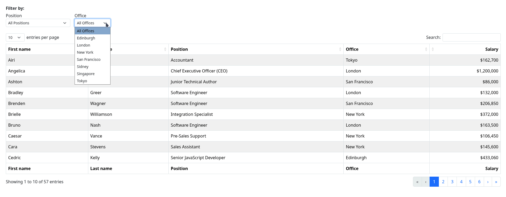

# DataTables Bootstrap Filter Dropdown

DataTables Bootstrap Filter Dropdown is a plugin for [DataTables](https://datatables.net/) that adds a dropdown element for selected columns to a DataTable, allowing the user to filter the table to only show rows containing a certain value.


______________________________________________________________________

<!-- mdformat-toc start --slug=github --maxlevel=6 --minlevel=2 -->

- [Description](#description)
  - [Key Features](#key-features)
  - [Screenshot](#screenshot)
- [Usage](#usage)
- [Example](#example)
- [Special Features](#special-features)
  - [Server-Side Processing](#server-side-processing)
    - [Request](#request)
      - [Example](#example-1)
    - [Response](#response)
      - [Examples](#examples)
    - [Error Handling](#error-handling)
- [Configuration Options](#configuration-options)
- [Dependencies](#dependencies)
- [Frequently Asked Questions](#frequently-asked-questions)
  - [I have a column with HTML-styled data, and the option list of its dropdown still contains parts of the HTML. How do I filter by the plain value only?](#i-have-a-column-with-html-styled-data-and-the-option-list-of-its-dropdown-still-contains-parts-of-the-html-how-do-i-filter-by-the-plain-value-only)

<!-- mdformat-toc end -->

______________________________________________________________________

## Description<a name="description"></a>

Adds a dropdown element for selected columns to a DataTable, allowing the user to
filter the table to only show rows containing a certain value. e.g. in a list of
employees to only show the ones that have an office in a certain city.

The filter element extracts all unique values from a column and adds them sorted and
stripped as options.

### Key Features<a name="key-features"></a>

- Uses column header as default title, can be overridden with custom title
- Supports Bootstrap 5 styling
- Supports server-side processing

### Screenshot<a name="screenshot"></a>

Dropdown Filter in action:



## Usage<a name="usage"></a>

- Download the latest release from [GitHub](https://github.com/ppfeufer/datatables-filterdropdown/releases/latest)
- Include`datatables-filterdropdown.min.js` into your HTML file, after the DataTables JS
- Add a filterDropDown section in the DataTables initialization object

## Example<a name="example"></a>

```html
<script src="datatables-filterdropdown.min.js"></script>

<script>
    $(document).ready(() => {
        new DataTable($('#example'), {
            // …
            filterDropDown: {
                labelFilter: 'Filter this table', // Optional, default is "Filter by"
                // 3rd column (index 2) and 4th column (index 3) will get a filter element
                columns: [
                    {
                        idx: 2,
                        labelDropdownAll: 'All Offices', // Option to override the default "All"
                        title: 'Office' // This will be the title of the select element. If not provided, the header text of the respective column will be used
                    },
                    {
                        idx: 3,
                        labelDropdownAll: 'All Positions', // Option to override the default "All"
                        title: 'Position' // This will be the title of the select element. If not provided, the header text of the respective column will be used
                    }
                ]
            }
        })
    });
</script>
```

Also see folder `examples` for complete examples including both vanilla HTML and
Bootstrap.

## Special Features<a name="special-features"></a>

### Server-Side Processing<a name="server-side-processing"></a>

DataTables can use server-side processing, and `datatables-filterdropdown` also
supports it.

To use server-side processing, your app will need two things:

- An endpoint for `datatables-filterdropdown` that provides the necessary data,
  similar to the endpoint needed to power DataTables server-side processing feature.
- The endpoint for DataTables must support the feature of searching columns with
  regex (`columns[{num}][search][regex]`)

To enable server-side processing, just provide a URL to that endpoint in the `ajax`
property of the `filterDropDown` init array.

The endpoint for `datatables-filterdropdown` needs to implement the following:

#### Request<a name="request"></a>

The endpoint will receive a GET request with the following query parameter:

- `columns`: list of requested columns, either by name or index (depends on
  `columns` definition)

##### Example<a name="example-1"></a>

```plain
https://www.example.com/endpoint?columns=2,3,0
https://www.example.com/endpoint?columns=office,position,name
```

Column names will match the names defined in the DataTables init array under
`data` for each column.

#### Response<a name="response"></a>

The endpoint will need to respond with a JSON object that has the requested columns
as property keys, and the sorted list of options as its respective values.

Note that all data processing like selecting unique values and sorting is expected
to happen by the server.

##### Examples<a name="examples"></a>

```json
{
    "office": [
        "Edinburgh", "London", "New York", "San Francisco", "Sidney", "Tokyo"
    ],
    "position": [
        "Accountant", "Customer Support", "Data Coordinator", "Developer"
    ]
}
```

```json
{
    "2": [
        "Edinburgh", "London", "New York", "San Francisco", "Sidney", "Tokyo"
    ],
    "3": [
        "Accountant", "Customer Support", "Data Coordinator", "Developer"
    ]
}
```

#### Error Handling<a name="error-handling"></a>

In case columns are missing in the response, those will be reported with a warning
in the browser console.

## Configuration Options<a name="configuration-options"></a>

All configuration options must be set in the `filterDropDown` section of the initialization array for your respective DataTable.

| Option                     | Type   | Mandatory           | Default                                             | Description                                                                                                                                                               |
| -------------------------- | ------ | ------------------- | --------------------------------------------------- | ------------------------------------------------------------------------------------------------------------------------------------------------------------------------- |
| bootstrapVersion           | int    | No                  | `5`                                                 | Set the Bootstrap version for rendering. Currently only Bootstrap 5 is supported.                                                                                         |
| labelFilter                | string | No, but recommended | `"Filter by"`                                       | Text displayed at the beginning of the filter row. This option can be useful if the label should be shown in other languages                                              |
| ajax                       | string | No                  | `null`                                              | URL to server endpoint for server-side processing. Enabled by providing a value.                                                                                          |
| columns                    | array  | Yes                 |                                                     | Array of definitions, one for each column that gets a filter element                                                                                                      |
| columns[].idx              | number | Yes                 |                                                     | Index of selected column, starting at 0 for the first column. Same as indices used in DataTables config array                                                             |
| columns[].labelDropdownAll | string | No, but recommended | `"All"`                                             | Text displayed for the "All" option in the dropdown.                                                                                                                      |
| columns[].maxWidth         | string | No                  | `null`                                              | CSS value to assigned to max-width. Use `"null"` to turn off automatic max-width or specify a custom width, e.g. `"5em"`                                                  |
| columns[].title            | string | No                  | The header text of the column you want to filter by | Filter dropdown label for the respective column. This is useful if you want to filter by the contents of an invisible column that usually would not have any header label |

## Dependencies<a name="dependencies"></a>

- jQuery: 3, 4
- DataTables: 1, 2, 3
- Bootstrap: 5

## Frequently Asked Questions<a name="frequently-asked-questions"></a>

### I have a column with HTML-styled data, and the option list of its dropdown still contains parts of the HTML. How do I filter by the plain value only?<a name="i-have-a-column-with-html-styled-data-and-the-option-list-of-its-dropdown-still-contains-parts-of-the-html-how-do-i-filter-by-the-plain-value-only"></a>

Add an invisible column containing only the plain values and filter by that column
instead. Use `columns[].title` to set the correct title for the dropdown element.
